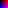

# .npxl formatting

`{dimx} {dimy} {color}`

The dimension numbers show how many pixels wide and tall the image will be, while the last number indicates how many characters should be in each pixel, 1 for grayscale and 3 for full-color

`{base}` 

number system to use when reading characters,
`2` is binary,
`10` is decimal,
`16` is hexadecimal,
`64` is base64, etc.

`{data}`

don't add spaces in between just list characters

The idea here is to describe a brightness value with just one UTF-8 character, standardizing lengths in the process. This means not only will each value only use one character, but there will also not be space character in between

## grayscale example:

```
32 8 1
16
0123456789abcdef0123456789abcdef
0123456789abcdef0123456789abcdef
0123456789abcdef0123456789abcdef
0123456789abcdef0123456789abcdef
0123456789abcdef0123456789abcdef
0123456789abcdef0123456789abcdef
0123456789abcdef0123456789abcdef
0123456789abcdef0123456789abcdef
```
This data corresponds to the `gray` images in PNG and PPM. It is a 32x8 image using one base-16 value for each pixel


## color example:

```
8 8 3
16
000200400600800a00c00e00
002202402602802a02c02e02
004204404604804a04c04e04
006206406606806a06c06e06
008208408608808a08c08e08
00a20a40a60a80aa0ac0ae0a
00c20c40c60c80ca0cc0ce0c
00e20e40e60e80ea0ec0ee0e
```

This data corresponds to the `color` images in PNG and PPM. It is an 8x8 image using three base-16 values for each pixel

